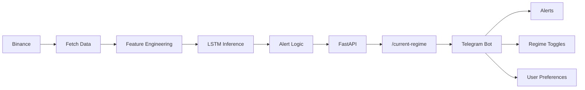

## Crypto Market Regime Service

**Real-time market regime detection for crypto markets using deep learning.** This service classifies the current market state (trend, chop, volatility) using multi-timeframe OHLCV data and serves it via API and Telegram alerts.

Features:
- Real-time regime status
- Toggle regime-based notifications
- Toggle alert-based notifications
- Button-based UI (no commands required)

> Note: Alerts are informational only and not trading signals.

🔍 What this project does
-------------------------

Most trading strategies fail because they ignore _market regime_.

This project continuously:

*   Fetches live BTCUSDT data (5m + 15m)
    
*   Engineers technical & volatility features
    
*   Runs a trained **LSTM-based regime classifier**
    
*   Outputs **probabilities across 6 market regimes**
    
*   Sends alerts via **Telegram** when important regime events occur
    

It is designed as a **microservice**, not a trading bot.

 Market Regimes (Model Output)
--------------------------------

The model classifies the market into one of the following regimes:

- **Choppy High-Vol** - Noisy price action with large swings
- **Range** - Sideways consolidation
- **Squeeze** - Low volatility, compression phase
- **Strong Trend** - Sustained directional move
- **Volatility Spike** - Sudden volatility expansion
- **Weak Trend** - Directional bias but fragile

Each prediction includes **probabilities**, not just a label.

🏗 Architecture Overview
------------------------

📡 API
------

### GET /current-regime

Example response:
{
  "symbol": "BTCUSDT",
  "current_regime": "Strong Trend",
  "confidence": 0.71,
  "probabilities": {
    "Choppy High-Vol": 0.10,
    "Range": 0.02,
    "Squeeze": 0.01,
    "Strong Trend": 0.71,
    "Volatility Spike": 0.09,
    "Weak Trend": 0.07
  },
  "timestamp": 1766424417
}

 Telegram Bot Features
------------------------

* Toggle regime-based alerts

* Toggle event-based notifications

* Alerts for:

    * Strong trend confirmation

    * Choppy market warnings

    * Regime transitions

* On-demand status check

* Button-based UI (no commands required)

User preferences are persisted locally.
    

🚀 Running the project
----------------------

### Requirements

*   Python 3.10+
    
*   Virtualenv
    
*   Binance public API access
    

### Setup
git clone https://github.com/akash-kumar5/regime-service.git
cd regime-service
python -m venv venv
source venv/bin/activate 
pip install -r requirements.txt

## ⚙️ Production Notes

- The worker runs continuously and fetches live Binance data.
- The model outputs probabilistic regimes, not deterministic signals.
- Alerts use confidence thresholds and regime transitions to avoid noise.
- Designed to be redeployed easily or run locally to manage infrastructure costs

## ⚠️ Disclaimer

This project is for **research and educational purposes only**.

- Not financial advice
- Not a trading bot
- No guarantees of profitability
- Crypto markets are highly risky

Use at your own discretion.

